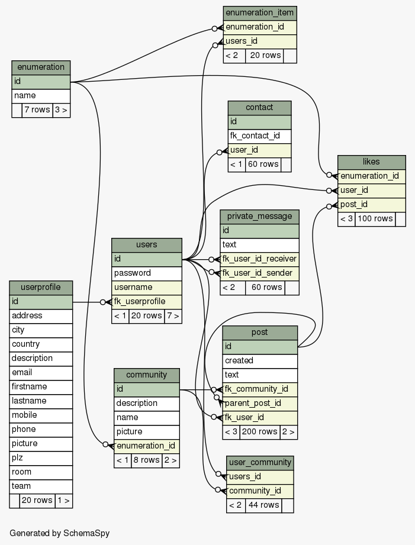

# chr-krenn-fhj-ws2017-sd17-pse
Students SW-Project

## Links
* Virtual Machine: ftp://mesen.fh-joanneum.at/common/Teiniker-Fedora-VMs/Fedora-26-XFCE-2017-09-30.ova
* SCRUM and Task-Management: https://tree.taiga.io/project/p0intr-swd15-pswengi/

# Setup & run
 
Please read the contributing rules: https://github.com/chr-krenn/chr-krenn-fhj-ws2017-sd17-pse/blob/master/CONTRIBUTING.md
  
Copy the content of 
<pre>~/eclipse-workspace/chr-krenn-fhj-ws2017-sd17-pse/doc/data/SETUP_WILDFLY/</pre>
into 
<pre>~/install/wildfly-10.1.0.Final/</pre>

Clone Repository
<pre>
cd ~/eclipse-workspace
git clone https://github.com/chr-krenn/chr-krenn-fhj-ws2017-sd17-pse
</pre>
Enable and start database service:
<pre>
systemctl enable mariadb.service
systemctl start mariadb.service
</pre>
Use MySQL shell to set up the database, grant privileges, and insert test data:
<pre>
cd ~/eclipse-workspace/chr-krenn-fhj-ws2017-sd17-pse/
mysql -u root -p
</pre>
Copy/paste the following commands to __create the database__:
<pre>
source sql/init.sql;
exit
</pre>
Start the Wildfly server with the __standalone.sh__.
<pre>
~/install/wildfly-10.1.0.Final/bin/standalone.sh
</pre>
After that run the __JUnit tests__ or __make a deployment__. Hibernate will generate the tables for the application itself.
<pre>
cd ~/eclipse-workspace/chr-krenn-fhj-ws2017-sd17-pse/
mvn wildfly:deploy
</pre>
To run the Application correctly __insert some sample data__. Without them no login will be possible.
<pre>
mysql -u root -p
</pre>
Now run the insert sql script which you can find in __sql directory__ of the app. To add just a few test entries execute
<pre>
source sql/insert.sql;
</pre>
To add a bigger set of sample data for 200 users including realistic user profiles, contacts, etc. execute
<pre>
source sql/insert_sample_data.sql;
</pre>
Users 1-20 have the admin role, 21-100 are portal admins, 101-200 are normal users.
Login credentials for the bigger sample data set:
<pre>
id    role        username  password
  1   ADMIN       bob       pass
 21   PORTALADMIN frank     pass
101   USER        alice     pass
</pre>

To access the application open in Browser: http://localhost:8080/pse/login.xhtml

## Important
Don't use scripts which are archived into the __doc directory__. Those are only archived for the possibility to reuse them if needed.   
The JUnit test would fail if the tables contain any data. To clean the tables use the __truncate.sql__ script in the sql directory. 
<pre>source sql/truncate.sql;</pre>
If something went wrong drop the database and make a new clean setup of the database. 
<pre>drop database pse;</pre>
If you clean your local git repository don't forget to delete the deployment section in the standalone.xml of Wildfly. For this purpose search for the standalone.xml in the __~/install/wildfly-10.1.0.Final/standalone/configuration/__ directory. Go to the end of the file and delete the __\<deployments\>...\<\/deployments\>__ tag.

## UI Testing
UI tests reside in _src/test/selenium/_ and need sample data from _insert_sample_data.sql_ to be imported to be able to run successfully. __Setup a new project__ containing only UI tests: __Import Maven -> src/test/integration/pom.xml__
### Setup Selenium IDE
* Download Firefox 54: https://ftp.mozilla.org/pub/firefox/releases/54.0/linux-x86_64/en-US/firefox-54.0.tar.bz2
* Extract files -> delete update & update-settings.ini
* Run extracted firefox executable
* about:preferences#advanced -> Never check for updates
* https://addons.mozilla.org/de/firefox/addon/selenium-ide/
* ALT + CTRL + S
### UI Test Class Diagram

## Optional
Set up management user to access WildFly management console at http://localhost:9990:
<pre>
~/install/wildfly-10.1.0.Final/bin/add-user.sh
</pre>

## Database Design
This database diagram is automatically generated by doc/generate_database_doc.sh. Rerun this script after making any changes to the database schema. Detailed database documentation can be viewed at doc/db_schema/index.html.

