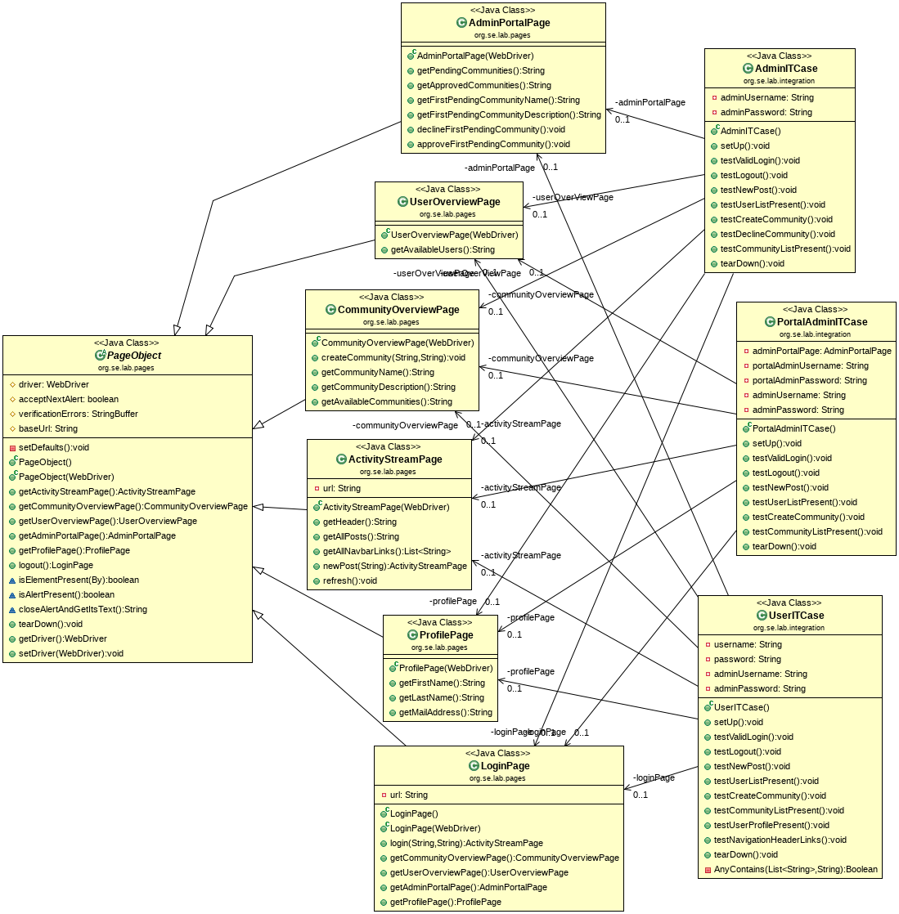

# chr-krenn-fhj-ws2017-sd17-pse
Students SW-Project

## Links
* Virtual Machine: ftp://mesen.fh-joanneum.at/common/Teiniker-Fedora-VMs/Fedora-26-XFCE-2017-09-30.ova
* SCRUM and Task-Management: https://tree.taiga.io/project/p0intr-swd15-pswengi/

# Setup & run
 
Please read the contributing rules: https://github.com/chr-krenn/chr-krenn-fhj-ws2017-sd17-pse/blob/master/CONTRIBUTING.md
  
Clone Repository
<pre>
cd ~/eclipse-workspace
git clone https://github.com/chr-krenn/chr-krenn-fhj-ws2017-sd17-pse
</pre>
Copy the content of 
<pre>~/eclipse-workspace/chr-krenn-fhj-ws2017-sd17-pse/doc/data/SETUP_WILDFLY/</pre>
into 
<pre>~/install/wildfly-10.1.0.Final/</pre>
Enable and start database service:
<pre>
systemctl enable mariadb.service
systemctl start mariadb.service
</pre>
Use MySQL shell to set up the database, grant privileges, and insert sample data:
<pre>
cd ~/eclipse-workspace/chr-krenn-fhj-ws2017-sd17-pse/
mysql -u root -p
</pre>
Copy/paste the following commands to __create the database__:
<pre>
source sql/init.sql;
exit
</pre>
Start the Wildfly server with the __standalone.sh__ (use doc/data/SETUP_WILDFLY/standalone/configuration/standalone.xml configuration to use the MySQL datasource).
<pre>
~/install/wildfly-10.1.0.Final/bin/standalone.sh
</pre>

After that run the unit/integration tests or deploy the app:
<pre>
# deploy the app without any testing as fast as possible
# (sample data will still be inserted!)
mvn clean wildfly:deploy -DskipTests -Djacoco.skip=true

# run unit tests and package application:
mvn clean package

# run unit tests and deploy application:
mvn clean wildfly:deploy

# run unit/integration tests with coverage analysis, deploy application, run UI tests:
mvn clean wildfly:deploy verify

# run unit tests:
mvn test

# run unit tests, DAO tests, and UI tests:
mvn clean verify
</pre>

To access the application open: http://localhost:8080/pse/index.xhtml

## Code coverage analysis
Code coverage reports for unit and integration tests are generated at 
* target/site/jacoco-ut/index.html 
* target/site/jacoco-it/index.html

## Static code analysis
 Run mvn pmd:pmd for pmd report
 Run mvn pmd:cpd for cpd report
 Run mvn jdepend:generate for jdepend report
 Run mvn test site for findbugs report(compile source before)

 All reports will be shown in target/site directory 

## Important
Don't use scripts which are archived into the __doc directory__. Those are only archived for the possibility to reuse them if needed.   
The JUnit test would fail if the tables contain any data. To clean the tables use the __truncate.sql__ script in the sql directory. 
<pre>source sql/truncate.sql;</pre>
If something went wrong drop the database and make a new clean setup of the database. 
<pre>drop database pse;</pre>
If you clean your local git repository don't forget to delete the deployment section in the standalone.xml of Wildfly. For this purpose search for the standalone.xml in the __~/install/wildfly-10.1.0.Final/standalone/configuration/__ directory. Go to the end of the file and delete the __\<deployments\>...\<\/deployments\>__ tag.

## UI Testing
### Setup Selenium IDE
* Download Firefox 54: https://ftp.mozilla.org/pub/firefox/releases/54.0/linux-x86_64/en-US/firefox-54.0.tar.bz2
* Extract files -> delete update & update-settings.ini
* Run extracted firefox executable
* about:preferences#advanced -> Never check for updates
* https://addons.mozilla.org/de/firefox/addon/selenium-ide/
* ALT + CTRL + S
### UI Test Class Diagram

## Optional
Set up management user to access WildFly management console at http://localhost:9990:
<pre>
~/install/wildfly-10.1.0.Final/bin/add-user.sh
</pre>

## Database Design
This database diagram is automatically generated by doc/generate_database_doc.sh. Rerun this script after making any changes to the database schema. Detailed database documentation can be viewed at doc/db_schema/index.html.

