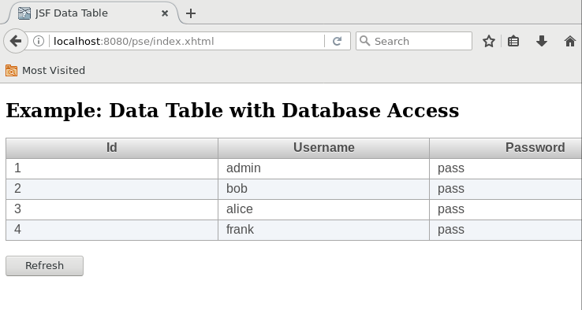

# chr-krenn-fhj-ws2017-sd17-pse
Students SW-Project

## Links
* Virtual Machine: ftp://mesen.fh-joanneum.at/common/Teiniker-Fedora-VMs/Fedora-26-XFCE-2017-09-30.ova
* SCRUM and Task-Management: https://tree.taiga.io/project/p0intr-swd15-pswengi/
# Configure WildFly server:
* Configure WildFly according to instructions in doc/data/SETUP_WILDFLY/
* __FIX WRONG JPA ANNOTATIONS in the Java source!__
* Make sure index.xhtml displays all sample users __after following the setup instructions below:__

## Setup
Clone Repository
<pre>
cd ~/eclipse-workspace
git clone https://github.com/chr-krenn/chr-krenn-fhj-ws2017-sd17-pse
</pre>
Enable and start database service:
<pre>
systemctl enable mariadb.service
systemctl start mariadb.service
</pre>
Use MySQL shell to set up the database, grant privileges, and insert test data:
<pre>
cd ~/eclipse-workspace/chr-krenn-fhj-ws2017-sd17-pse/
mysql -u root -p
</pre>
Copy/paste the following commands to __create the database__ and __insert sample data__:
<pre>
CREATE DATABASE pse;
GRANT SELECT, INSERT, UPDATE, DELETE, CREATE, DROP, INDEX, ALTER ON `pse`.* TO 'student'@'localhost';
use pse;
source sql/create.sql;
source sql/insert.sql;
exit
</pre>
Set up management user to access WildFly management console at http://localhost:9990 (optional):
<pre>
~/install/wildfly-10.1.0.Final/bin/add-user.sh
</pre>
## Run
Start WildFly server:
<pre>
~/install/wildfly-10.1.0.Final/bin/standalone.sh
</pre>
Deploy App:
<pre>
cd ~/eclipse-workspace/chr-krenn-fhj-ws2017-sd17-pse/
mvn wildfly:deploy
</pre>
Open in Browser: http://localhost:8080/pse/

## Database Design
This database diagram is automatically generated by doc/generate_database_doc.sh. Rerun this script after making any changes to the database schema. Detailed database documentation can be viewed at doc/db_schema/index.html.

